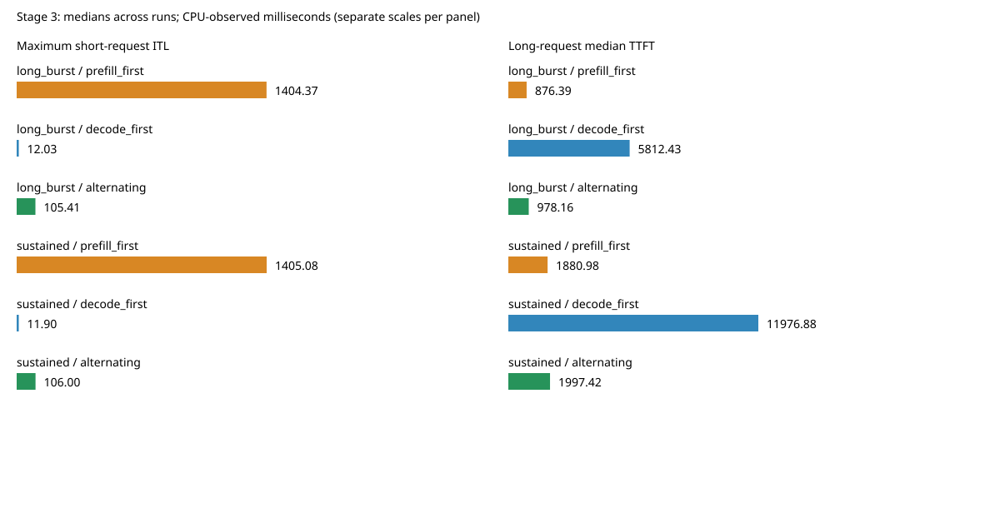

# 阶段三实验报告：调度顺序与流式延迟的取舍

## 结论

在固定 prefill 预算 1024 的长请求突发负载中，交替调度将短请求最大 token 间隔从 1404.37 ms 降至 105.41 ms，降低约 92.5%，总输出吞吐基本持平。但短请求 P95 间隔从 13.19 ms 增至 93.44 ms，长请求中位 TTFT 增加约 11.6%。它把少数长停顿分散为更多短停顿，不能描述为所有延迟指标都改善。

decode 优先将短请求间隔保持在约 12 ms，却让长请求首 token 等待明显增长，并降低总体吞吐。阶段二说明“只缩小分块不够”；阶段三进一步证明批次选择顺序会改变延迟分配。

## 实现

新增 `python/minisgl/scheduler/policy.py`，由 Scheduler 调用策略选择下一个 batch；资源准入、KV 分配和释放仍由原有 manager 执行。

- `prefill_first`：默认策略，保留原始 prefill 优先顺序。
- `decode_first`：优先执行 decode，没有可执行 decode 才尝试 prefill。
- `alternating`：上次成功选择 prefill 后优先 decode，否则优先 prefill；优先阶段无法组批时尝试另一阶段；空闲后重置。

通过配置字段 `scheduling_policy` 和服务参数 `--scheduling-policy` 选择策略。交替发生在独立批次之间，本阶段没有实现同一个 batch 中混合 prefill 和 decode，也没有时间预算或请求 aging。

## 实验设置与来源

性能数据采集于 2026-09-11；生命周期补充验证与报告整理于 2026-09-14。性能运行代码提交为 `0f2e0ea4d5cd430012437fb43521043200bc1a40`。原始元数据 `source_dirty=true`：运行期间存在文档及后处理工具改动；本次提交归档最终文件，核心策略和性能入口保持该运行版本。

单张 NVIDIA A800 80GB PCIe，Meta-Llama-3.1-8B-Instruct，BF16，PyTorch 2.9.1+cu128；CUDA Graph 开启、最大 batch 8，关闭 overlap，naive cache，32768 个单 token KV 页，最多 8 个运行请求，固定 prefill 预算 1024。三个策略各预热一次，三个负载与三个策略组成九个配置，每配置重复五次，共 45 次正式运行，轮换并反转执行顺序。

| 负载 | 短请求 | 长请求 |
|---|---|---|
| short_only | 4 个，输入 128、输出 256，0 秒到达 | 无 |
| long_burst | 同上 | 4 个，输入 4096、输出 128，0.3 秒同时到达 |
| sustained | 4 个，输入 128、输出 512，0 秒到达 | 8 个，输入 4096、输出 128，从 0.3 秒起每 0.15 秒到达 |

采用固定随机种子生成的 token ID 控制输入长度，完整输入保存在 `evidence/workloads.json`。这是调度微基准，不是语义质量数据集；sustained 是有限到达序列。正常性能回放使用 greedy、ignore_eos，固定输出长度。

ITL 为相邻输出 token 的 CPU 观测时间差；TTFT 从计划到达时刻计至首 token，包含调度等待。先在每轮合并短请求间隔计算分位数/最大值，再对五轮指标取中位数。吞吐是每轮全部输出 token 数除以该轮耗时，再取中位数。这些指标不等于 GPU kernel 时间，也不含真实 HTTP 网络路径。

## 结果

### 长请求突发

| 策略 | 短请求 P95 ITL（ms） | 短请求最大 ITL（ms） | 长请求 P50 TTFT（ms） | 输出吞吐（token/s） |
|---|---:|---:|---:|---:|
| prefill_first | 13.19 | 1404.37 | 876.39 | 335.14 |
| decode_first | 11.66 | 12.03 | 5812.43 | 147.95 |
| alternating | 93.44 | 105.41 | 978.16 | 335.23 |

五轮最大 ITL 范围：prefill_first 为 1354.78–1408.97 ms，alternating 为 102.56–106.92 ms。吞吐 335.14 与 335.23 的微小差异不能作为提升结论。

原始批次轨迹显示 prefill_first 连续执行多个 prefill 分块；alternating 在 prefill 分块间插入 decode。因此每个 prefill 仍会造成可见停顿，但不再累计为一次很长的中断。默认策略的大停顿占全部间隔比例低，P95 容易漏掉它；交替后更多间隔包含 prefill 耗时，所以 P95 增大。评估必须同时看分布和最大值。

### 有限持续到达

| 策略 | 短请求 P95 ITL（ms） | 短请求最大 ITL（ms） | 长请求 P50 TTFT（ms） | 输出吞吐（token/s） |
|---|---:|---:|---:|---:|
| prefill_first | 13.22 | 1405.08 | 1880.98 | 335.07 |
| decode_first | 11.74 | 11.90 | 11976.88 | 147.89 |
| alternating | 93.31 | 106.00 | 1997.42 | 335.55 |

decode_first 的长请求最大首次调度等待中位数达到 17.57 秒。这说明严格 decode 优先会推迟新请求；有限实验完成不代表无限流量下不存在饥饿，也不构成等待上界证明。

short_only 对照组三策略吞吐均约 342 token/s，短请求最大 ITL 均约 12 ms。本次样本中未见明显性能退化，未进行统计显著性检验。

## 验证与输出差异

- 14 个 CPU 单元测试通过：阶段一 4 个、阶段二 2 个、阶段三策略测试 8 个。
- 45 次 GPU 回放全部完成，检查输出长度、请求完成、分块预算、重复完成防护、请求槽位归还和 cache 完整性；每轮分别输出 1024、1536、3072 个 token。
- 9 个额外 GPU 生命周期用例通过：三个策略分别验证 EOS/长度结束、等待与分块请求取消、decode 请求取消。使用真实 GPU 前向与人为固定的采样结果触发边界，验证终止及资源释放机制，不是模型自然 EOS 生成质量测试。
- 每个配置的五轮输出哈希相同。以第 0 轮比较不同策略，short_only 完全一致；long_burst 两个新策略各有 4 个请求不同；sustained 的 decode_first 有 4 个、alternating 有 3 个请求不同。首个差异位置与 token 见 `evidence/output_comparison.json`（位置从 0 开始）。

不同调度会改变 batch 组成，BF16 数值敏感性是可能原因；阶段一曾定位过具体样本的舍入/argmax 差异，但不能直接解释本阶段所有差异。本阶段未逐一定位首次 logits 分歧，因此不宣称跨策略逐 token 等价，也不把输出数量与资源检查当成完整内容正确性证明。

## 复现与适用范围

命令见 [README.md](README.md)。原始 45 轮事件、输出、汇总、完整输入、生命周期结果均在 `evidence/`；执行 `python study/stage03_scheduling/summarize.py study/stage03_scheduling/evidence` 可重新核算各轮事件指标并生成比较图。

本阶段验证范围为单卡、naive cache、关闭 overlap 的离线回放。多卡、Radix、overlap、真实网络负载及自然语言质量尚未覆盖。交替仅保证可执行阶段之间的批次轮换，资源不足时仍可能等待，不提供请求公平性或延迟 SLO 保证。

后续可在交替策略基础上联合扫描分块预算，加入 decode 延迟目标和请求等待 aging，再用真实开源请求长度分布检验取舍。面试中应突出“定位连续 prefill 导致的长停顿、实现可切换策略、用对照实验证明最大间隔改善并揭示 P95/TTFT 代价”的完整过程。
