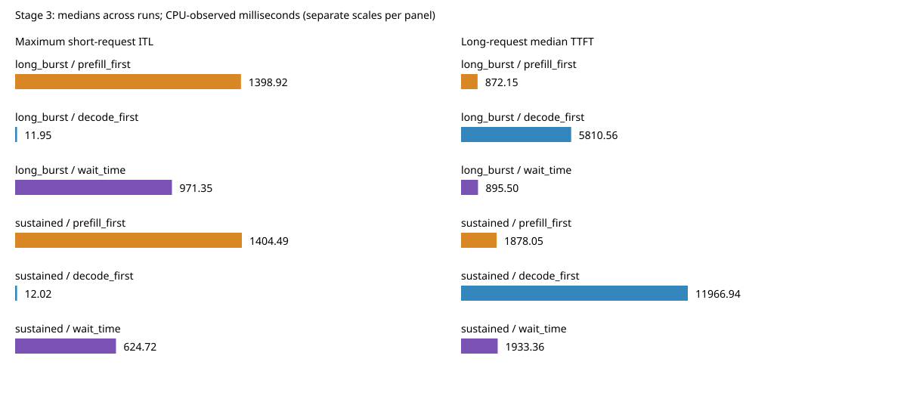

# 阶段三补充：带等待时间阈值的公平调度

## 原计划与本次范围

以根目录 [实验计划](../../实验计划.md) 的阶段三为依据。此前实现的 `alternating` 属于额外对照，未覆盖“带等待时间约束的策略”这一主要改动。本次补齐 `wait_time`、阈值配置、决策日志、状态与边界测试，并重新比较 `prefill_first`、`decode_first`、`wait_time`。

本报告区分规则实现、有限负载验收与性能目标。得到调度机会不等于严格延迟保证；代码实现完成不代表混合负载 P95/P99 已改善。

## 规则和计时口径

每个请求维护当前阶段的等待起点。prefill 从引擎接收入队开始；decode 从加入 running 集合开始。选中请求在批次选择时重置起点，未选中请求保持年龄；分块续跑仍属于 prefill，转入 decode 时重新计时；完成和取消后清理。每类取最大等待间隔参与决策。

1. decode 间隔达到 50 ms 时优先 decode。
2. prefill 间隔达到 200 ms 时优先 prefill。
3. 同时触发时，比较各自“等待间隔减阈值”，值较大者优先；相同时优先 decode。
4. 都未触发时优先 prefill；优先阶段不能组批时回退到另一阶段；保留 1024 token 的 prefill 预算。

50/200 ms 是首版实验参数，不是调优结论。计时使用单调 CPU 时钟，间隔包含上次被选择后的执行和结果处理，不是纯排队时间。GPU 批次不可抢占；双重超时裁决也可能继续推迟已超时的另一类请求，因此实际间隔可以远大于阈值。

策略只选择阶段，未改变 prefill manager 的队列内顺序、资源准入或 KV 分配。pending 存在不代表可执行，回退在日志中明确标记。本版 `wait_time` 拒绝 TP>1，防止不同 rank 的本地时钟产生不一致的批次选择；未验证 overlap/Radix，后续按原计划补充。

## 配置与日志交付

新增 `--decode-wait-ms`、`--prefill-wait-ms`、`--log-scheduling-decisions`，策略通过 `--scheduling-policy wait_time` 开启。默认仍为原始 prefill 优先。阈值必须有限且大于 0，非法配置在 Engine 初始化前拒绝。

决策日志含两类等待值、阈值、最老 UID、跟踪数量、触发原因、优先/实际阶段、回退和预算。日志默认不输出到服务控制台，回放以 JSONL 保存所有策略的决策；只有 `wait_time` 跟踪等待时间，基线日志的等待值为 null。独立审计脚本从日志重新计算阈值与裁决，校验后续 batch 和预算，不调用策略实现。

## 实验方法

2026-09-14，单张 A800 80GB PCIe，Llama-3.1-8B-Instruct，BF16，Graph 开启、overlap 关闭、naive cache；32768 个单 token KV 页、最多 8 个运行请求、固定 prefill 预算 1024。使用与前期对照相同的固定随机 token 输入与到达序列。性能回放 greedy、ignore_eos、固定生成长度，代表调度微基准而非自然语言质量评估。

| 负载 | 短请求 | 长请求 |
|---|---|---|
| short_only | 4 个，输入 128 / 输出 256，0 秒到达 | 无 |
| long_burst | 同上 | 4 个，输入 4096 / 输出 128，0.3 秒同时到达 |
| sustained | 4 个，输入 128 / 输出 512，0 秒到达 | 8 个，输入 4096 / 输出 128，从 0.3 秒起每 0.15 秒到达 |

三个策略各预热一次，每种负载与策略组合测量五轮，旋转并反转顺序，共 45 轮。sustained 是有限请求序列，未模拟无限到达。比较使用本次同场测得的基线，不混用此前日期的数据计算提升。

所有时间为 CPU 观测：ITL 为输出 token 间隔，TTFT 从计划到达至首 token；不是 HTTP 客户端时间或 GPU kernel 时间。表格先在每轮计算指标，再对五轮取中位数。short_only/long_burst 每轮短请求 ITL 样本数为 1020，sustained 为 2044；相同 batch 的请求间隔存在相关性，P99 只能作微基准描述，不能据此推出生产环境尾延迟。

性能核心与入口版本为 `bb945a9`，最终归档另含文档、决策审计与后处理脚本。`source_dirty=true` 包含用户提供但当时尚未纳入 Git 的实验计划及运行期间编辑的文档/后处理工具；性能代码在运行期间未修改。元数据、输入哈希及源码文件哈希随证据保存。

## 结果

以下为每配置五轮指标的中位数。

### 长请求突发

| 策略 | 短请求 P95 ITL（ms） | P99 ITL（ms） | 最大 ITL（ms） | 长请求 P50 TTFT（ms） | 吞吐（token/s） |
|---|---:|---:|---:|---:|---:|
| prefill_first | 13.21 | 13.41 | 1398.92 | 872.15 | 335.00 |
| decode_first | 11.66 | 11.85 | 11.95 | 5810.56 | 147.97 |
| wait_time | 13.25 | 100.73 | 971.35 | 895.50 | 334.89 |

### 有限持续到达

| 策略 | 短请求 P95 ITL（ms） | P99 ITL（ms） | 最大 ITL（ms） | 长请求 P50 TTFT（ms） | 吞吐（token/s） |
|---|---:|---:|---:|---:|---:|
| prefill_first | 13.23 | 13.34 | 1404.49 | 1878.05 | 335.39 |
| decode_first | 11.73 | 11.77 | 12.02 | 11966.94 | 147.62 |
| wait_time | 13.32 | 105.29 | 624.72 | 1933.36 | 334.68 |

突发负载最大间隔降低约 **30.6%**，有限持续到达降低约 **55.5%**；吞吐分别变化约 -0.03%、-0.21%，本样本基本持平，不能把微小差异当作显著收益。长请求中位 TTFT 分别增加约 2.7%、2.9%。

**主要性能目标尚未达成：P95 没有改善，P99 明显增大。** 新策略减少了部分最长停顿，却把更多间隔推入 P99 尾部。不能只展示最大值下降来宣称公平调度已经全面优化。此前交替对照的最大停顿更小，但其 P95 更大；该比较来自前期实验，只作背景，未在本次重新测量交替策略。

short_only 三策略吞吐中位数分别为 341.47、341.34、341.82 token/s，最大间隔约 12 ms，未见明显额外开销；这不是单独隔离日志或计时字典开销的实验。

波动范围（每轮最大 ITL）：突发基线 1355.56–1405.44 ms、wait_time 946.50–972.18 ms；持续到达基线 1373.01–1406.20 ms、wait_time 616.16–627.86 ms。各轮完整分位数保存在 `summary.json`，不以单轮最佳值报告。



## 为什么超过阈值后仍有长停顿

突发负载第 0 轮，短请求 uid=0 的最长间隔位于 0.4847–1.4312 秒，约 946.50 ms，期间有 **11 个连续 prefill 批次、11264 个 token**，这些 prefill 的 CPU 观测执行跨度合计约 929.28 ms。持续到达第 0 轮的最长间隔约 616.16 ms，包含 7 个 prefill 批次、7168 个 token。汇总中 `decode_batches_in_gap=1` 是产生区间结束 token 的 decode，并不代表这些 prefill 之间有 decode 插入。

原因不仅是单个批次无法抢占：多个老 prefill 请求未被服务时会保留等待年龄，即便 decode 已超时，双重触发的固定裁决仍可能认为 prefill 超时更久。prefill manager 按原有队列顺序处理分块，阶段选择不会直接让最老的那个请求获得资源。因此 50 ms 是触发条件，既不是硬上界，也不能理解为“最多一个 prefill 后一定 decode”。

这是首版规则的适用局限，不是阈值未被执行。独立审计重新计算了所有决策，规则、回退、后续 batch 和 token 预算均匹配。是否改用其他双重触发规则或增加连续服务限制，需要另做明确对照，不能在这组数据中途换规则。

## 验证结果

- **30 个 CPU 单元测试通过**：阶段一 4 个、阶段二 2 个、阶段三 24 个。其中新策略使用可控时钟覆盖精确阈值、双重触发与平局、200 次持续双类可执行需求、资源阻塞、分块转换、未服务请求保留年龄、完成/取消/UID 复用及非法参数；另测试日志审计能拒绝错误决策或缺失 batch。
- 四种策略 CLI 配置解析与自定义阈值检查通过。TP>1 的 wait_time 在 Engine 构造前拒绝，避免加载模型后才发现配置不支持。
- **45 轮 GPU 回放通过**：逐请求输出长度、完成数量、重复完成防护、预算、cache 完整性、请求槽位回收与等待状态清空均通过。每轮期望总输出分别为 1024、1536、3072 token；另从保存的输出文件重算哈希及长度，与运行记录核对。
- **12 个 GPU 生命周期用例通过**：四种策略分别验证 EOS/长度、等待与分块取消、decode 取消。真实前向后用固定采样结果主动触发终止边界，不是自然 EOS 或语义质量测试。
- 所有 10 轮混合 wait_time 回放中，在两类请求同时存在的阶段都实际选择过 prefill 和 decode；第 0 轮突发组分别为 16、5 次，持续到达组为 32、137 次。这里的集合存在不等于始终资源可用；确定性的双类可执行测试与 GPU 资源回退记录共同支持有限范围的机会验收，不证明无限到达下的单请求公平性。

每个配置五轮输出哈希相同。比较第 0 轮，short_only 跨策略一致；long_burst 中 decode_first、wait_time 各有 4 个请求与基线不同；sustained 分别有 4 个、3 个请求不同。首个不同 token 的位置（从 0 开始）保存在 `output_comparison.json`。这些差异未逐一定位，**不宣称逐 token 等价或直接归因于浮点误差**；深入输出正确性调查按原计划放在阶段五，后续发现状态错误时必须回修。

## 阶段状态与复现

阶段三的等待阈值实现、可切换配置、决策日志和必要状态测试已补齐；有限负载的调度机会及生命周期检查通过。P95/P99 优化目标未通过，输出语义等价也尚未证明。阶段四至六仍按原实验计划推进，不把这些补充实验替代系统评估或正确性归因。

复现命令见 [README.md](README.md)。本次证据独立保存在 `evidence/wait_time/`，前期交替实验保留在上层 `evidence/`。可直接重算归档数据：

```bash
python study/stage03_scheduling/summarize.py study/stage03_scheduling/evidence/wait_time
python study/stage03_scheduling/audit_decisions.py study/stage03_scheduling/evidence/wait_time
```

单卡、固定长度的离线微基准是本阶段边界。真实负载、多档到达率、接近饱和、预算扫描、KV 紧张、overlap/Radix、长期运行和 Nsight 时间线，继续按阶段四、五安排。自适应分块仍是后续扩展。
