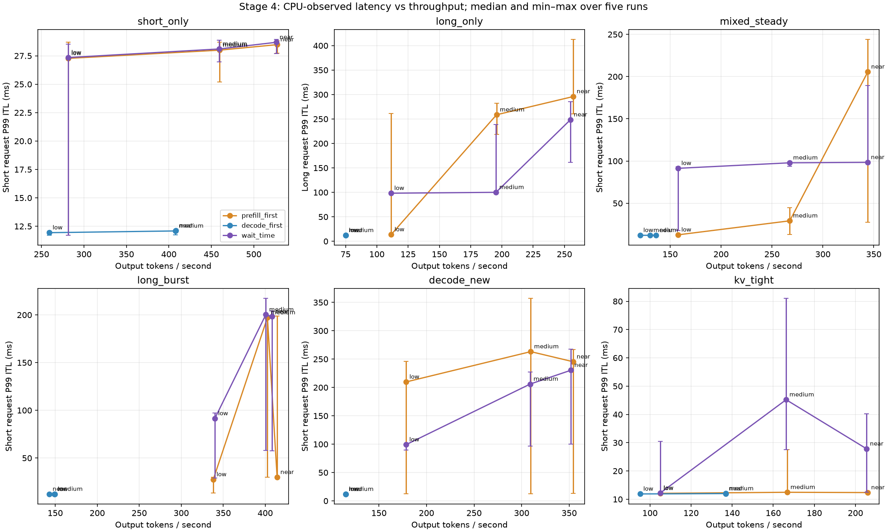

# 阶段四：基于 ShareGPT 提示词的系统评估

状态：357 组测量与独立聚合校验已完成：先导 12、固定预算 270、预算扫描 40、扩大样本确认 35。正式配置均为五轮，测量代码版本为 `bfb319a20860047afedc090339e9b347f27c05e0`。

主要结论：等待阈值策略在本轮稳定混合负载中改善短请求 P99，吞吐基本持平；默认预算在突发负载中出现退化，预算调优后的收益较小且波动明显。它不是通用最优策略，也没有达到严格延迟保证。

## 评估问题与范围

沿用原定六阶段计划，本阶段先固定 prefill 预算比较原始 prefill 优先、decode 优先和带等待阈值的策略，再在独立调参集上扫描预算，最后扩大样本验证选中配置。等待阈值仍为 decode 50 ms、prefill 200 ms，调度规则不变。

主指标为混合负载 P95/P99 ITL，同时观察短请求分组、TTFT、吞吐、错误率和最长等待。最大间隔改善不能替代 P95/P99 改善；吞吐 95% 门槛是候选选择条件，不是性能承诺。

使用单卡 A800、Llama-3.1-8B-Instruct、BF16、CUDA Graph、naive cache，关闭 overlap。正常场景 65536 个单 token KV 页，最多 8 个运行请求，序列上限 8192；KV 紧张场景使用 4608 页。每个合法请求均能单独放入 KV 容量，压力来自并发准入与资源保留，而不是故意构造永远无法执行的请求。

## 数据来源与划分

文件为 ShareGPT_V3_unfiltered_cleaned_split.json，SHA256 为 `35f0e213ce091ed9b9af2a1f0755e9d39f9ccec34ab281cd4ca60d70f6479ba4`，本地校验通过。来源链接与命令见 [README.md](README.md)。实际包含 94145 条记录，不能直接当成独立会话。

预处理保留完整起始 user 提问（允许首条 system 消息），不把助手开头的续篇当作完整请求。共过滤 35147 条不完整/不适用开头，去除 12435 条重复渲染 prompt，另排除 115 条超出 32–4096 token 范围的输入。token 长度包含本地 Llama chat template，不做填充或截断。

| 数据组 | short：32–512 | medium：513–2047 | long：2048–4096 | 合计 |
|---|---:|---:|---:|---:|
| tune | 8178 | 966 | 240 | 9384 |
| eval | 32484 | 3793 | 787 | 37064 |

按原始会话 ID 分组哈希划分，去掉数字分片后缀；tune/eval 之间无会话交叉或完全相同的渲染 prompt。未进行近似语义去重。调参及正式评估分别使用不同 seed 和到达序列，策略间则共享完全相同的输入、到达时间与输出上限。

本轮混合场景刻意按 short/long 各半采样，medium 保留在本地池中但未用于二类对照。因此这是**真实提示词上的受控压力评估**，不是 ShareGPT 全体长度分布或真实线上流量回放。输出长度固定为 short 256、long 128 token，并忽略 EOS，参考回答文本不参与正确性判定。

## 负载与测量流程

| 场景 | 到达与用途 |
|---|---|
| short_only | 纯短提示词，指数分布到达间隔，检查常见短输入开销 |
| long_only | 纯长提示词，指数分布到达间隔，检查长输入性能 |
| mixed_steady | 长短 1:1、随机顺序、指数分布到达间隔 |
| long_burst | 短请求逐个到达，长请求每四个同时到达 |
| decode_new | 四个输出 512 token 的背景短请求先到达，再注入长请求；背景是有限请求，不保证覆盖整个到达区间 |
| kv_tight | 长短 1:1、指数间隔、4608 KV 页，观察准入受限后的行为 |

先导使用 tune 数据的 24 请求同时到达回放估算容量，再探测压力。以观察到队列积压或接近运行槽位上限的到达率为锚点，low/medium/near 分别取其 0.35/0.65/0.95。该锚点来自有限负载，不是经过稳态极限测量证明的饱和点。突发组 rate 分别控制短请求间隔及长请求批间隔，不能等同于合并流的平均请求率。

固定预算矩阵为 6 场景 × 3 档位 × 3 策略 × 5 轮，每轮 24 请求。每个配置用前八条同类型请求、生成八个 token 预热，预热不计时。配置按轮次旋转/反转顺序，正常 KV 容量与紧张容量在独立进程中分别测量，避免重建引擎造成状态混杂。

随后仅在 tune 的稳定混合与突发 near 组比较 prefill_first/1024 与 wait_time 的 256、1024、4096 预算，各五轮。候选需满足基线吞吐的 95%，再选短请求 P99 最小者；无候选时保留 1024 并标记失败。最后在不同 seed 的 eval 数据上，以每轮 80 请求、各五轮比较默认配置与选中预算。

## 指标、隐私与验证边界

所有时延来自 CPU 调度器观测，TTFT 从计划到达计时，包含入口滞后与排队；不是 HTTP 客户端或 GPU kernel 时间。输出吞吐以整轮输出数量除以观测时长，有限回放包含到达等待和排空阶段，不等于稳态引擎峰值吞吐。请求级分位数与 token 级间隔分别统计，图表使用每轮指标的五轮中位数及最小/最大值。

24 请求混合组每轮只有 3060 个短请求间隔，扩大至 80 请求后每轮有 10200 个。相同 batch 的多个请求共享或接近输出时间，这些间隔不独立；P99 是样本描述，五轮极差也不是置信区间，不据此直接承诺生产尾延迟。

每轮验证输出长度、完成数、无重复完成、分块预算、cache 完整性、请求槽位归还、等待状态清空。聚合导出从本地数据重建工作负载哈希、重新计算指标、核对输出文件哈希和长度，并检查各策略输入相同。跨策略输出差异只汇总数量，不宣称语义等价，也不直接归因于浮点误差。

原始对话、token 序列、会话 ID 与逐请求轨迹留在被 Git 忽略的目录；发布内容仅含脚本、配置、来源哈希和聚合统计。测试覆盖跨 Python 进程的哈希种子变化，防止容器遍历顺序影响随机抽样。

## 正式结果

以下均为五轮指标的中位数；改善百分比是中位数之比，不是每轮改善率的中位数。完整逐轮聚合数值、极差和全部压力档位见 [comparison.json](evidence/comparison.json)。

### 固定预算：near 档位

| 场景 / 档位 | 策略 / 预算 | 全体 P95 ITL/ms | 全体 P99 ITL/ms | 短请求 P99 ITL/ms | 全体 P99 TTFT/ms | 输出 token/s | 最长首次调度等待/s |
|---|---|---:|---:|---:|---:|---:|---:|
| decode_new / near | decode_first / 1024 | 11.80 | 11.95 | 11.81 | 29220.91 | 115.04 | 27.73 |
| decode_new / near | prefill_first / 1024 | 13.59 | 238.22 | 245.33 | 3839.60 | 354.37 | 3.56 |
| decode_new / near | wait_time / 1024 | 13.71 | 230.45 | 230.45 | 3945.95 | 351.92 | 3.68 |
| kv_tight / near | decode_first / 1024 | 11.88 | 11.98 | 11.97 | 14073.68 | 136.97 | 14.09 |
| kv_tight / near | prefill_first / 1024 | 12.10 | 12.33 | 12.36 | 7673.36 | 206.04 | 7.57 |
| kv_tight / near | wait_time / 1024 | 12.12 | 12.35 | 27.82 | 7715.16 | 205.45 | 7.61 |
| long_burst / near | decode_first / 1024 | 12.01 | 12.17 | 12.17 | 26931.01 | 142.94 | 25.50 |
| long_burst / near | prefill_first / 1024 | 12.83 | 29.60 | 29.87 | 5092.66 | 414.15 | 5.18 |
| long_burst / near | wait_time / 1024 | 12.87 | 133.49 | 198.18 | 5107.96 | 408.27 | 5.20 |
| long_only / near | decode_first / 1024 | 11.81 | 12.03 | — | 29732.77 | 75.11 | 28.23 |
| long_only / near | prefill_first / 1024 | 13.83 | 295.95 | — | 2034.13 | 257.14 | 1.88 |
| long_only / near | wait_time / 1024 | 96.40 | 248.53 | — | 2049.88 | 254.82 | 1.88 |
| mixed_steady / near | decode_first / 1024 | 11.95 | 12.09 | 12.04 | 19065.47 | 136.28 | 18.53 |
| mixed_steady / near | prefill_first / 1024 | 12.97 | 212.91 | 205.61 | 789.11 | 344.17 | 0.79 |
| mixed_steady / near | wait_time / 1024 | 13.21 | 98.53 | 98.42 | 818.34 | 343.98 | 0.81 |
| short_only / near | decode_first / 1024 | 11.93 | 12.11 | 12.11 | 4369.90 | 408.36 | 4.23 |
| short_only / near | prefill_first / 1024 | 11.96 | 28.48 | 28.48 | 2697.50 | 527.51 | 2.73 |
| short_only / near | wait_time / 1024 | 11.97 | 28.69 | 28.69 | 2716.75 | 526.53 | 2.75 |

稳定混合组短请求 P99 从 205.61 降至 98.42 ms；突发组却从 29.87 升至 198.18 ms。纯长组虽降低 P99，全体 P95 从 13.83 升至 96.40 ms。KV 紧张组短请求 P99 从 12.36 升至 27.82 ms，而总体 P99 接近不变，说明只看总体指标会掩盖分组退化。纯短组收益不明显。

decode_first 的生成间隔约 12 ms，但新请求首次调度和 TTFT 显著恶化，吞吐下降。有限回放能完成不等于在持续负载下无饥饿；本阶段不能用完成率替代阶段三的调度机会测试。

### 独立 tune 集预算选择

| 场景 / 档位 | 策略 / 预算 | 短请求 P99 ITL/ms | 输出 token/s |
|---|---|---:|---:|
| long_burst / sweep | prefill_first / 1024 | 31.40 | 411.27 |
| long_burst / sweep | wait_time / 1024 | 196.85 | 408.59 |
| long_burst / sweep | wait_time / 256 | 253.55 | 378.01 |
| long_burst / sweep | wait_time / 4096 | 49.67 | 418.85 |
| mixed_steady / sweep | prefill_first / 1024 | 206.71 | 361.15 |
| mixed_steady / sweep | wait_time / 1024 | 99.76 | 360.35 |
| mixed_steady / sweep | wait_time / 256 | 69.60 | 342.02 |
| mixed_steady / sweep | wait_time / 4096 | 185.58 | 365.91 |

按预先定义的吞吐 ≥ 基线 95% 条件，稳定混合选中预算 1024，突发选中 4096；两者在 tune 集满足门槛。选中预算按场景分别使用，不能宣称获得统一最优预算。

### eval 扩大样本确认

每配置五轮，每轮 80 请求，短请求 ITL 每轮 10200 个。

| 场景 / 档位 | 策略 / 预算 | 短请求 P95 ITL/ms | 短请求 P99 ITL/ms | 全体 P99 TTFT/ms | 输出 token/s | 最长首次调度等待/s |
|---|---|---:|---:|---:|---:|---:|
| long_burst / confirm | decode_first / 1024 | 12.10 | 12.20 | 76487.06 | 163.45 | 76.12 |
| long_burst / confirm | prefill_first / 1024 | 12.85 | 196.79 | 17443.01 | 439.42 | 17.47 |
| long_burst / confirm | wait_time / 1024 | 12.91 | 215.20 | 17579.64 | 437.67 | 17.61 |
| long_burst / confirm | wait_time / 4096 | 12.95 | 185.91 | 16860.46 | 446.90 | 16.89 |
| mixed_steady / confirm | decode_first / 1024 | 12.05 | 12.17 | 70559.17 | 143.44 | 69.65 |
| mixed_steady / confirm | prefill_first / 1024 | 13.00 | 215.56 | 2726.93 | 404.86 | 2.73 |
| mixed_steady / confirm | wait_time / 1024 | 13.17 | 100.64 | 2800.70 | 404.22 | 2.79 |

| 场景 | 策略 / 预算 | 短请求 P99 五轮最小–最大/ms | 吞吐五轮最小–最大/token/s |
|---|---|---:|---:|
| long_burst | decode_first / 1024 | 12.18–12.24 | 151.89–165.70 |
| long_burst | prefill_first / 1024 | 29.60–218.60 | 435.07–456.17 |
| long_burst | wait_time / 1024 | 206.95–227.91 | 432.01–454.30 |
| long_burst | wait_time / 4096 | 180.39–220.98 | 438.27–465.01 |
| mixed_steady | decode_first / 1024 | 12.10–12.18 | 137.38–150.12 |
| mixed_steady | prefill_first / 1024 | 193.93–217.71 | 380.70–427.23 |
| mixed_steady | wait_time / 1024 | 99.10–216.33 | 380.63–426.61 |

- mixed_steady：选中预算 1024 的短请求 P99 降低 53.31%，吞吐变化 -0.16%，在独立 eval 上仍满足 95% 吞吐门槛。
- long_burst：选中预算 4096 的短请求 P99 降低 5.53%，吞吐变化 +1.70%，在独立 eval 上仍满足 95% 吞吐门槛。

稳定混合 wait_time 的五轮短请求 P99 范围为 99.10–216.33 ms，仍存在接近基线的慢轮次；53.31% 是五轮中位数改善，不代表每轮都改善同样幅度。

稳定混合的 P95 从 13.00 升至 13.17 ms，因此收益集中在 P99，不应表述为所有时延均改善。突发默认预算 1024 的 P99 从 196.79 升至 215.20 ms；调到 4096 后为 185.91 ms，收益有限且五轮范围重叠，尚不足以声称稳定显著提升。

## 正确性检查与尚未解决的问题

357 组记录均通过工作负载重建、指标重算、输出长度及哈希校验，记录错误数为 0；正式配置五轮齐全。运行期另检查 cache、槽位归还、等待状态及分块预算。聚合审计见 [audit_summary.json](evidence/audit_summary.json)。

跨策略/预算共比较 235 对运行、7040 对请求输出，其中 3350 对 token 序列不同。这包含多个配置对同一请求的重复比较，不是 3350 个独立用户请求，也不是错误率。计数见 [output_difference_counts.json](evidence/output_difference_counts.json)。长度与资源检查通过并不能证明 token 或语义正确；差异原因尚未在本阶段查明，留待阶段五对首次分歧位置、logits、批次组成和数值误差逐项归因。

最初发现跨进程集合遍历顺序影响抽样，已改为固定顺序，并对多个 PYTHONHASHSEED 测试。修复前的试运行已隔离，不进入本报告；本报告全部 357 组使用同一个修复后的版本。

## 结论与阶段五入口

本阶段验证了一个有适用条件的折中：在本轮稳定混合输入和到达模式下，等待阈值策略能以近似不变的吞吐降低短请求 P99；decode 优先付出明显的准入等待与吞吐代价；突发和 KV 紧张场景仍有负面结果。时间阈值只触发下一次决策，无法抢占已执行的 GPU 工作，也不约束所有准入排队时间。

下一阶段保持这份测量版本作为基准，先调查输出分歧，再覆盖 EOS、取消、分块、Radix/overlap 与长时间资源回收，并用 Nsight 定位长 prefill、批次变化与调度开销。当前不承诺线上 SLO，也不把 CPU 观测时间解释为单个 GPU kernel 耗时。

## 附录：全压力档位与端到端延迟

以下均为五轮中位数，ITL 和 TTFT 单位为 ms，端到端延迟单位为 s。

| 场景 | 档位 | 策略 | 全体 P95 ITL | 全体 P99 ITL | P99 TTFT | P99 端到端 | 输出 token/s |
|---|---|---|---:|---:|---:|---:|---:|
| decode_new | low | decode_first | 11.81 | 11.97 | 16215.56 | 17.70 | 114.91 |
| decode_new | low | prefill_first | 13.00 | 167.38 | 463.81 | 7.85 | 178.58 |
| decode_new | low | wait_time | 13.10 | 98.88 | 513.89 | 7.84 | 178.49 |
| decode_new | medium | decode_first | 11.79 | 11.97 | 25246.47 | 26.73 | 114.96 |
| decode_new | medium | prefill_first | 13.61 | 246.02 | 1838.14 | 9.36 | 309.59 |
| decode_new | medium | wait_time | 80.14 | 186.14 | 1868.72 | 9.38 | 309.02 |
| decode_new | near | decode_first | 11.80 | 11.95 | 29220.91 | 30.70 | 115.04 |
| decode_new | near | prefill_first | 13.59 | 238.22 | 3839.60 | 10.30 | 354.37 |
| decode_new | near | wait_time | 13.71 | 230.45 | 3945.95 | 10.28 | 351.92 |
| kv_tight | low | decode_first | 11.78 | 11.92 | 6179.76 | 8.86 | 95.16 |
| kv_tight | low | prefill_first | 11.93 | 12.08 | 2473.56 | 4.75 | 104.96 |
| kv_tight | low | wait_time | 11.93 | 12.12 | 2492.91 | 4.55 | 104.96 |
| kv_tight | medium | decode_first | 11.87 | 12.02 | 10868.55 | 13.16 | 136.79 |
| kv_tight | medium | prefill_first | 12.10 | 12.36 | 5116.81 | 7.52 | 166.77 |
| kv_tight | medium | wait_time | 12.11 | 27.56 | 5190.91 | 7.57 | 166.26 |
| kv_tight | near | decode_first | 11.88 | 11.98 | 14073.68 | 16.09 | 136.97 |
| kv_tight | near | prefill_first | 12.10 | 12.33 | 7673.36 | 10.86 | 206.04 |
| kv_tight | near | wait_time | 12.12 | 12.35 | 7715.16 | 10.90 | 205.45 |
| long_burst | low | decode_first | 12.01 | 12.16 | 18733.77 | 20.28 | 149.04 |
| long_burst | low | prefill_first | 12.84 | 28.57 | 1106.27 | 5.02 | 338.12 |
| long_burst | low | wait_time | 12.89 | 91.42 | 1137.70 | 5.05 | 340.00 |
| long_burst | medium | decode_first | 12.07 | 12.14 | 21715.64 | 24.69 | 149.33 |
| long_burst | medium | prefill_first | 12.83 | 64.11 | 3338.19 | 7.04 | 402.63 |
| long_burst | medium | wait_time | 12.86 | 198.39 | 3371.68 | 7.08 | 400.71 |
| long_burst | near | decode_first | 12.01 | 12.17 | 26931.01 | 28.43 | 142.94 |
| long_burst | near | prefill_first | 12.83 | 29.60 | 5092.66 | 8.26 | 414.15 |
| long_burst | near | wait_time | 12.87 | 133.49 | 5107.96 | 8.28 | 408.27 |
| long_only | low | decode_first | 11.81 | 12.04 | 14022.61 | 15.50 | 74.95 |
| long_only | low | prefill_first | 12.96 | 13.71 | 533.11 | 2.81 | 111.44 |
| long_only | low | wait_time | 13.04 | 98.25 | 565.29 | 2.80 | 111.28 |
| long_only | medium | decode_first | 11.81 | 12.06 | 25454.66 | 26.94 | 75.08 |
| long_only | medium | prefill_first | 13.66 | 258.63 | 707.90 | 3.58 | 195.70 |
| long_only | medium | wait_time | 93.29 | 100.09 | 776.74 | 3.60 | 195.29 |
| long_only | near | decode_first | 11.81 | 12.03 | 29732.77 | 31.22 | 75.11 |
| long_only | near | prefill_first | 13.83 | 295.95 | 2034.13 | 4.90 | 257.14 |
| long_only | near | wait_time | 96.40 | 248.53 | 2049.88 | 4.95 | 254.82 |
| mixed_steady | low | decode_first | 11.93 | 12.05 | 7676.63 | 9.16 | 120.43 |
| mixed_steady | low | prefill_first | 12.45 | 12.84 | 316.41 | 3.91 | 157.77 |
| mixed_steady | low | wait_time | 12.49 | 91.96 | 372.12 | 3.90 | 157.78 |
| mixed_steady | medium | decode_first | 11.93 | 12.05 | 17988.21 | 19.47 | 130.34 |
| mixed_steady | medium | prefill_first | 12.85 | 29.19 | 407.82 | 4.55 | 267.45 |
| mixed_steady | medium | wait_time | 12.95 | 97.96 | 466.81 | 4.44 | 267.51 |
| mixed_steady | near | decode_first | 11.95 | 12.09 | 19065.47 | 21.36 | 136.28 |
| mixed_steady | near | prefill_first | 12.97 | 212.91 | 789.11 | 5.07 | 344.17 |
| mixed_steady | near | wait_time | 13.21 | 98.53 | 818.34 | 5.08 | 343.98 |
| short_only | low | decode_first | 11.84 | 11.94 | 2840.16 | 5.83 | 259.22 |
| short_only | low | prefill_first | 11.86 | 27.27 | 41.24 | 3.13 | 281.27 |
| short_only | low | wait_time | 11.86 | 27.34 | 41.42 | 3.13 | 281.32 |
| short_only | medium | decode_first | 11.92 | 12.09 | 3199.68 | 6.21 | 407.90 |
| short_only | medium | prefill_first | 11.94 | 28.00 | 1074.94 | 4.17 | 459.73 |
| short_only | medium | wait_time | 11.97 | 28.10 | 1079.47 | 4.17 | 459.32 |
| short_only | near | decode_first | 11.93 | 12.11 | 4369.90 | 7.39 | 408.36 |
| short_only | near | prefill_first | 11.96 | 28.48 | 2697.50 | 5.77 | 527.51 |
| short_only | near | wait_time | 11.97 | 28.69 | 2716.75 | 5.79 | 526.53 |
