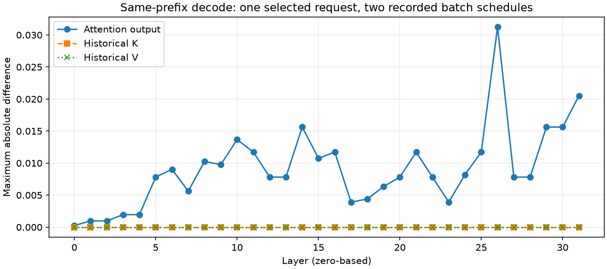

# 阶段五实验 5.2：隐藏状态、KV 与 lm_head 舍入

状态：本实验完成。先执行 4 次边界探索，再增加 RoPE 后输入探针执行 4 次确认回放；下表使用后 4 次确认结果。阶段五整体尚未完成。

## 结论

选中案例的最早已观测差异出现在 **第 0 层 decode 注意力后端输出**：两侧的 embedding、归一化结果、QKV 投影、RoPE 后 Q/K、V、当前写入 KV 及历史 KV 均完全一致，注意力输出最大绝对差为 `0.000244140625`。

差异传递至后续层，进入 lm_head 的归一化隐藏状态最大绝对差为 `0.125`。以各自实际隐藏向量及模型权重对两个候选做 CPU float64 点积，两侧均是候选 A 略高；BF16 舍入后，基线仍 A > B，等待策略变为 A = B，实际 argmax 选择了词表索引较小的 B。

这比“可能是浮点误差”更具体：已有同输入的后端差异、隐藏状态差异和舍入导致候选平局的实证链。**尚未定位 FlashInfer 内部具体的分块/归约路径，不能宣称全部输出差异已解释，也不能据此判定完整缓存实现无误。**

## 案例与控制

沿用实验 5.1 的稳定混合 near 轨迹，选择生成索引最早分歧的请求：输入 2132 token，第 2 个生成 token 分歧（索引 1）。该位置在此前 eager 对照中前缀一致、argmax 不同。

使用自然 greedy 生成，没有 teacher forcing 或人工写回输出。两条轨迹的 prefill 分块均为 `[0,1024)`、`[1024,2048)`、`[2048,2132)`；目标 decode 在两侧均为 8 请求批次，但其他请求的长度、历史和整体批次条件可能不同。

基线与等待策略各回放两次，每次全程输出都与实验 5.1 无本轮探针的 eager 输出一致。两个重复的逻辑张量与数值观测也一致，排除了本轮探针改变自然生成结果这一混淆。探针会同步 GPU，所有运行只用于诊断，不计入阶段四吞吐和时延结果。

模型与配置：Llama-3.1-8B-Instruct、A800、BF16、eager、naive cache、page_size=1、65536 页、最大 8 请求、预算 1024、overlap 关闭。运行日志确认自动选择 `fi`；本地 [FlashInfer 后端](../../python/minisgl/attention/fi.py) 构造 wrapper 使用 `backend="fa2"`。这描述实现配置，不等同于已取得具体 kernel 的性能归因。

## KV 检查范围

后 4 次确认运行合计通过 16 次目标相关步骤映射检查、1024 次分层 K/V 写入比较：

- 当前可见运行/分块请求的有效页无重叠、无越界，不落入空闲页集合。该检查依赖 naive cache 不共享页的前提。
- 目标逻辑 position 与 `[cached_len, device_len)` 一致，目标写入地址与页表对应片段一致。
- 每层真实缓存写入内容与本次提交的 K/V 张量逐元素一致。
- 首次分歧前，按逻辑 token 顺序抽取的 **32 层历史 K/V 均在两策略间完全一致**。
- 完成后 cache 完整性、输出长度和请求槽位归还检查通过。

物理页编号本身不要求跨运行相同；比较的是页映射约束及按逻辑位置读取的内容。以上仅覆盖本案例相关步骤，不涵盖 Radix 共享、淘汰、取消和 overlap，也未单独验证 FlashInfer 内部 plan 对全部索引的消费行为。

## 中间状态证据

| 第 0 层 decode 边界 | 两侧最大绝对差 |
|---|---:|
| embedding / input norm | 0 |
| QKV 投影 | 0 |
| RoPE 后 Q/K 与后端 V | 0 |
| 历史 K/V、当前写入 K/V | 0 |
| 注意力输出 | 0.000244140625 |
| o_proj 输出 | 0.00048828125 |
| post-attention norm 输出 | 0.0030517578125 |
| MLP down 输出 | 0.0009765625 |
| 最终 norm 输出，进入 lm_head | 0.125 |

目标三段 prefill 的第 0 层所有已采集边界均逐元素一致。decode 后续层的注意力输出差异见图；这是一例逐层差异描述，不意味着误差单调增长，也不是误差上界。

完整聚合数值见 [hidden_summary.json](evidence/hidden_summary.json)。

## 高精度参考注意力

对已经完成 RoPE 的同一 Q 和按逻辑顺序拼接的历史及当前 K/V，使用 CPU float64 计算单步 GQA 注意力：`softmax(QKᵀ / sqrt(head_dim))V`。单步 decode 读取截至当前 token 的全部 KV；该参考不包含未来 token，也不重新做 RoPE。

两侧参考输出完全一致。真实后端结果相对参考的最大绝对误差均约 `0.0003097861`；平均绝对误差分别为 `0.0000055196` 和 `0.0000053572`。后端结果与参考舍入至 BF16 的结果也并非逐元素一致。

这支持后端执行上下文下的数值路径存在差异，而不是目标逻辑 Q/K/V 原本就不同。CPU float64 是高精度对照，不是对所有底层实现的形式化正确性证明；本实验未冻结内核 split-KV/归约计划，尚不能给出具体 kernel 级原因。

## lm_head 候选重算

候选 A、B 为原始基线和等待策略分别选中的 token，词表 ID 不公开。下面是**各自实际隐藏向量**与对应 BF16 模型权重转成 float64 后的点积，不是整个模型 FP64 推理，也不是对全部词表候选的重算。

| 轨迹 | A 的 float64 点积 | B 的 float64 点积 | 舍入 BF16 后 A/B | 实际候选分数 A/B |
|---|---:|---:|---|---|
| 基线 | 21.1918694897 | 21.1782684152 | 21.25 / 21.125 | 21.25 / 21.125 |
| 等待策略 | 21.1810231539 | 21.1806074742 | 21.125 / 21.125 | 21.125 / 21.125 |

两侧舍入结果都与实际分数一致。等待策略两候选真实点积仅差约 `0.00041568`，舍入后打平；已核验 B 的词表索引较小，且实际生成 token 等于已观测的 argmax。此案例说明舍入与平局选择是最终 token 翻转链条的一部分，但不证明仅升级 lm_head 精度即可消除其他请求的差异。

## 验证与下一步

本阶段 CPU 测试现为 7 项，通过跨分块对齐、缺口/重叠拒绝、差值统计和 GQA 分组参考计算测试。源码与配置哈希见 [hidden_provenance.json](evidence/hidden_provenance.json)。原始隐藏状态、Q/K/V、logits 与请求标识仅保存在本地 `runs/`。

本轮没有修改核心调度、注意力或模型精度。后续生命周期测试、缺陷修复与 Nsight 性能归因见 [阶段五总报告](REPORT.md)。若要进一步解释数值差异，需要固定注意力内核计划做单变量对照。本案例本身不能替代阶段五整体验收。
