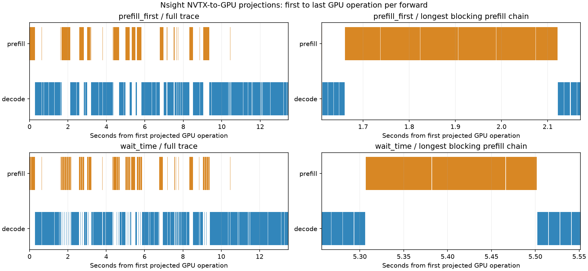

# 阶段五：正确性与性能归因

状态：阶段五验收完成。阶段六尚未开始。

本阶段回答两个问题：调度变化后的请求生命周期是否正确；等待策略为什么能改善部分混合负载中的 decode 间隔。输出差异诊断、资源回收测试和性能时间线分别取证，不能互相替代。

## 1. 实际发现并修复的缺陷

### overlap 请求终止与资源释放

修复前 GPU 用例在 EOS 后收到额外结果，触发 `Duplicate output after terminal result`，见 [失败摘要](evidence/regression_before.json)。GPU 提前执行的下一批，也会使设备侧长度提前到达上限；若直接用它判断主机结果是否结束，会提前标记完成。

在 [scheduler.py](../../python/minisgl/scheduler/scheduler.py) 中增加每个请求的在途批次数及终止状态。主机实际追加 token 后判断长度；已终止请求的后续结果被丢弃，直到在途批次清空才归还资源。取消操作同时查找已离开 decode 队列但仍在执行的请求。资源复用前，通过 CUDA stream 等待保证引擎已排队的 token 写入完成。

四个 CPU 回归用例覆盖 EOS 后推测结果、主机/设备长度错位、最后一批在途取消和重复取消。GPU 补充用例在 decode 已启动后执行取消，并检查取消后不再输出。

### Radix 活跃页表仍引用重复页

前缀插入发现已有共享页时，旧实现释放重复页，却没有更新活跃请求页表。例如当前页表 `[4,5,6,7]`，共享页应为 `8`，释放 `6` 后仍读 `6`；该页被重新分配后可能读到其他请求的数据。

在 [cache.py](../../python/minisgl/scheduler/cache.py) 中先将活跃页表改为 `[4,5,8,7]`，再释放原重复页 `6`。释放列表必须先克隆，避免延迟释放持有的视图随页表修改而变成 `8`。对应 CPU 回归测试在修改前失败、修改后通过。GPU 共享前缀用例检查两个请求的共享页相同，并逐批验证活跃页表匹配缓存句柄、没有引用空闲页。

## 2. 正确性与资源回收验收

设备为单张 A800，模型 Llama-3.1-8B-Instruct，TP=1。生命周期矩阵使用 4096 个 token 页、page size=1、最多 8 个请求、最大序列 2048、prefill 预算 256，CUDA Graph 最大 batch size=8。

| 维度 | 覆盖 |
|---|---|
| 策略 | prefill_first、decode_first、wait_time |
| 缓存 | naive、radix |
| overlap | 关闭、开启 |
| 基础边界 | EOS、长度截断、分块完成、等待/分块取消、decode 队列取消 |
| 缓存与复用 | 重复前缀、超过容量的不同前缀、槽位与 KV 反复回收 |
| 补充边界 | 同时共享前缀、已启动 decode 的取消、第三个输出触发 EOS |

基础矩阵共 180 个具名用例，补充矩阵 36 个用例；另有 1200 波回收测试，共完成 9600 个请求。每波排空后检查缓存完整性、8 个唯一槽位全部归还、无保护前缀残留、请求队列及等待计时/在途/终止状态清空。

最终持续测试通过：运行 600.13 秒，1218 波，共完成 9744 个请求；每波资源检查均通过。持续测试仅使用 radix＋overlap＋wait_time，每波 8 个请求、每请求 16 个输出，变化输入长度，并在每波结束后检查资源。

CPU 验证为阶段一至五 55 项 unittest，加原项目缓存分配 6 项 pytest，共 61 项通过。生命周期 GPU 测试保留真实模型前向，但强制采样指定 token，以稳定触发 EOS、长度和取消边界；它们验证生命周期，不衡量回答语义质量。

最终源码版本通过 SHA-256 核对。overlap 修复后的四组基础矩阵均验证；Radix 页表修复后重跑两组受影响的 Radix 基础矩阵，四组补充矩阵均使用最终核心源码。naive 基础矩阵是在 Radix 专属修复之前完成，不能声称整个矩阵在同一次构建中重跑。聚合证据及源码哈希见 [lifecycle_summary.json](evidence/lifecycle_summary.json)。

## 3. 输出差异查明到什么程度

[实验 5.1](DIVERGENCE_REPORT.md) 在阶段四固定预算比较中找到 682/2160 对输出差异，全部发生在首 token 之后。选定轨迹的 Graph 两次回放都能复现原输出；修复 overlap 后再次运行两策略各两次 Graph 回放，四次仍匹配原记录。该回放使用 naive、关闭 overlap，只支持这一受控案例的输出回归结论。

[实验 5.2](HIDDEN_REPORT.md) 对一个自然生成分歧定点检查：第 0 层同一逻辑位置的 Q/K/V 和历史 KV 一致，最早观测到的差异位于注意力后端输出，最大绝对差值为 0.000244140625；最终归一化隐藏向量差值达到 0.125。候选分数重算显示 BF16 舍入与同分时词表索引选择参与了最终 token 翻转。

因此，已有证据支持该案例的后端数值路径差异；尚未确定具体 split-KV/归约内核原因，也不能把全部 682 对差异都归因于同一原因。生命周期缺陷的发现更说明，不能把所有输出差异直接称作正常浮点误差。

## 4. Nsight 性能归因

使用 Nsight Systems 2025.1.3，对同一个 mixed_steady/near 代表性输入分别运行 prefill_first 和 wait_time。选用阶段四五次重复中的 r4；两侧输入及到达计划哈希一致，24 个请求、34689 个输入 token、4608 个输出 token。加载与预热不在采集窗口内。

这里执行真实的时间驱动策略选择；不是固定批次回放。配置为 naive、关闭 overlap，单策略各采集一次；采集开销可能改变决策时机，不以这两次运行重新估计 P99 收益。

| Nsight 指标 | prefill_first | wait_time |
|---|---:|---:|
| prefill 批次数 | 49 | 50 |
| decode 批次数 | 845 | 847 |
| prefill GPU 投影跨度之和 | 3008.02 ms | 2996.88 ms |
| decode GPU 投影跨度之和 | 9951.71 ms | 9983.14 ms |
| 有 decode 等待时，最长连续 prefill 链的批次数 | 6 | 3 |
| 该链的首尾 GPU 跨度 | 460.70 ms | 194.92 ms |

时间线与汇总均来自 Nsight NVTX-to-GPU projection。一个投影范围覆盖该 forward 首个到最后一个相关 GPU 操作，可能包含间隙，并非纯 kernel 时间之和。默认 graph 级追踪没有展开 decode 图内部所有 kernel，所以 [profile_summary.json](evidence/profile_summary.json) 将显式 kernel 与 graph span 分开统计。右侧两图分别放大各自最长阻塞窗口，并非同一时刻的配对窗口。

两侧总工作量接近，主要变化是执行顺序：等待策略减少了一次连续安排多个 prefill 的阻塞，让 decode 获得执行机会。这支持阶段四观察到的延迟改善机制，而不是证明 GPU 计算量大幅减少。194.92 ms 仍可能超过等待阈值；阈值是调度触发条件，已启动的 GPU 批次不能随意抢占，也不能承诺严格延迟上限。

阶段四正式评估结果仍以其冻结版本和多次重复报告为准。本阶段没有重跑完整性能矩阵，也没有测量 Radix/overlap 修复后的性能收益。

## 5. 结论范围与可复现材料

本阶段交付两处核心修复、相应回归测试、GPU 生命周期矩阵、有限时长资源回收验证、输出分歧定位和实际 Nsight 时间线。十分钟无资源残留不构成无限运行无泄漏的证明；TP=1、page size=1 的结果不能外推到所有并行与分页配置。

复现命令见 [README](README.md)。公开仓库仅保存代码、中文报告、匿名聚合结果和图片；原始提示词、请求标识、输出 token、logits、中间张量和 Nsight 原始文件留在本地忽略目录。阶段六将基于这些证据整理面试项目材料。
