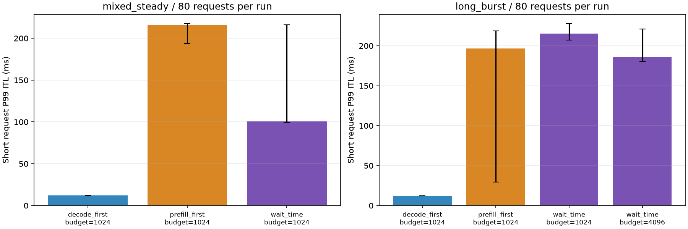

# 项目报告：LLM 推理公平调度优化与验证

基于 Mini-SGLang，在单卡推理中研究长 prefill 对正在生成请求的干扰，实现等待阈值调度，并通过独立数据划分、重复测量、生命周期回归和 Nsight 时间线验证收益与代价。

## 问题

prefill 优先有助于新请求进入运行集合，但长输入连续占用 GPU，会拉长已有请求的 token 间隔。简单 decode 优先又可能推迟新请求，恶化 TTFT 和有限回放吞吐。目标是在保留 prefill token 预算及原有资源管理的前提下，给两类可执行请求提供调度机会。

## 方案

在 BatchPolicy 中维护每请求的阶段等待起点；选择批次时比较两类最久等待。decode 达到 50 ms 或 prefill 达到 200 ms 时优先安排对应阶段；同时触发时选择超过自身阈值更多的一类，相同时 decode 优先；都未触发时 prefill 优先。优先阶段无法组批则尝试另一阶段。

仅被选中的请求重置等待起点，其他请求保留年龄。分块仍算 prefill，进入 decode 后重新计时；完成和取消清理状态。队列内顺序与 KV 准入逻辑仍由原 manager 负责。阈值不是延迟上限，首版 wait_time 仅支持 TP=1。

## 评估与结果

使用 ShareGPT 的真实起始提示词，按会话划分 tune/eval 并精确去重；到达时间人为生成，混合场景短长各半，固定输出上限。采用 A800、Llama-3.1-8B-Instruct、BF16、CUDA Graph、naive cache、关闭 overlap。完成 357 组测量，正式配置各五轮。

以下为独立 eval 扩大样本确认：每轮 80 请求、五轮指标中位数。主指标是**短请求 token 级 P99 ITL**，来自 CPU 调度器观测，不是客户端端到端 P99。

| 场景与配置 | 基线短请求 P99 | wait_time 短请求 P99 | P99 改善 | 输出吞吐变化 |
|---|---:|---:|---:|---:|
| 稳定混合，双方预算 1024 | 215.56 ms | 100.64 ms | 53.31% | −0.16% |
| 突发，基线预算 1024 / wait_time 4096 | 196.79 ms | 185.91 ms | 5.53% | +1.70% |

稳定混合的 P95 从 13.00 升至 13.17 ms，P99 TTFT 从 2726.93 升至 2800.70 ms；wait_time 五轮 P99 范围 99.10–216.33 ms。突发默认预算 1024 则退化到 215.20 ms，调优后范围仍重叠。收益集中在特定负载的尾部，不能称为所有请求稳定加速。完整配置、各轮数字与负面结果见 [阶段四报告](../stage04_system_evaluation/REPORT.md)。

## 正确性与归因

阶段五修复 overlap 的终止后额外输出、过早释放问题，以及 Radix 合并重复页后活跃页表未改指向的问题。完成 61 项测试、216 个 GPU 生命周期用例、1200 波回收检查；最终持续测试 600.13 秒完成 9744 请求，每波资源检查通过。有限持续测试不能证明无限运行无泄漏。

输出差异没有被一概归为浮点误差。固定轨迹回放及一个隐藏状态案例把最早观测差异定位到注意力后端输出，后续 BF16 舍入与候选同分选择参与 token 翻转；具体内核归约原因和全部差异的解释仍未完成。

代表性 Nsight 运行显示，两策略 GPU 总工作量接近，但最长连续 prefill 阻塞链从 6 批、460.70 ms 缩短到 3 批、194.92 ms，支持执行顺序改善 decode 机会的机制。每策略仅一次采集，不将这组跨度变化当作正式 P99 收益。详见 [阶段五报告](../stage05_correctness_attribution/REPORT.md)。

## 贡献、代价与局限

继承上游模型执行、KV 缓存、分块、CUDA Graph、overlap 和 TP 基础设施；本项目新增测量与工作负载工具、策略选择及等待状态、决策日志、系统评估、缺陷修复与归因材料。[贡献表](CONTRIBUTIONS.md) 给出源码与证据入口。

调度策略增加 CPU 等待状态维护，并未加速 attention kernel。性能结论限定为 TP=1、naive、关闭 overlap；Radix/overlap 测试证明有限范围的生命周期行为，不代表性能收益也成立。数据不是生产流量，相关 ITL 样本不能当作独立样本，五轮极差不是置信区间。未来可研究基于实测批次时间的预算调整，以及由单一 rank 广播决策的 TP 支持；两者尚未实现。
